# Second Memory - Architecture Diagrams

## 1. System Architecture Diagram

---

## 2. User Flow Diagram

---

## 3. Overall System Overview Diagram

```mermaid
graph TB
    subgraph "User Interface"
        U1[👤 User]
        U2[🌐 Browser: Chrome]
    end
    
    subgraph "Frontend Applications"
        F1[🧩 Chrome Extension<br/>Port: N/A<br/>Build: Vite + React]
        F2[📊 Web Dashboard<br/>Port: 5173 Dev<br/>Build: Vite + React]
    end
    
    subgraph "Frontend Features"
        FF1[📚 Bookmark Management]
        FF2[📸 Screenshot Capture]
        FF3[📕 PDF Export]
        FF4[🔍 Semantic Search]
        FF5[📖 Reader Mode]
        FF6[🏷️ Tagging & Categories]
        FF7[🎨 Multiple View Modes]
        FF8[⚡ Real-time Sync]
    end
    
    subgraph "Backend Infrastructure - Supabase"
        subgraph "Database Layer"
            DB1[(PostgreSQL Database)]
            T1[memories table<br/>- Full article text<br/>- Metadata<br/>- Tags array]
            T2[screenshots table<br/>- Extracted text<br/>- Image metadata]
            T3[pdfs table<br/>- Summaries<br/>- Full text]
        end
        
        subgraph "Storage Layer"
            S1[☁️ Supabase Storage]
            S2[memory-images bucket]
            S3[screenshots bucket]
            S4[pdfs bucket]
        end
        
        subgraph "Security & Features"
            SEC1[🔒 Row Level Security RLS]
            SEC2[🔑 API Authentication]
            SEC3[⚡ Real-time WebSocket]
            SEC4[📊 Full-Text Search GIN Index]
        end
    end
    
    subgraph "External AI Services"
        AI1[🤖 Google Gemini API]
        AI2[💬 Text Generation Model<br/>- Semantic search<br/>- Content analysis]
        AI3[👁️ Gemini Vision Model<br/>- OCR from screenshots<br/>- Text extraction]
        AI4[📄 Document Processing<br/>- PDF summarization<br/>- Content extraction]
    end
    
    subgraph "Core Technologies"
        T[Technology Stack]
        TS1[Frontend: React 18 + TypeScript]
        TS2[Build Tool: Vite]
        TS3[Styling: Tailwind CSS]
        TS4[Backend: Supabase BaaS]
        TS5[Database: PostgreSQL]
        TS6[AI: Google Gemini]
        TS7[Extension API: Chrome API]
    end
    
    subgraph "Key Workflows"
        W1[📥 Content Capture Flow]
        W2[🔍 Search & Discovery Flow]
        W3[💾 Storage & Sync Flow]
        W4[🧠 AI Processing Flow]
    end
    
    %% User Interactions
    U1 -.->|Browses Web| U2
    U2 --> F1
    U2 --> F2
    
    %% Frontend to Features
    F1 --> FF1
    F1 --> FF2
    F1 --> FF3
    F2 --> FF4
    F2 --> FF5
    F2 --> FF6
    F2 --> FF7
    
    %% Features to Backend
    FF1 -.->|CRUD API| DB1
    FF2 -.->|Upload| S1
    FF3 -.->|Upload| S1
    FF4 -.->|Query| DB1
    FF5 -.->|Fetch| DB1
    FF8 -.->|Subscribe| SEC3
    
    %% Database Relations
    DB1 --> T1
    DB1 --> T2
    DB1 --> T3
    
    %% Storage Relations
    S1 --> S2
    S1 --> S3
    S1 --> S4
    
    %% Security
    DB1 --> SEC1
    S1 --> SEC2
    DB1 --> SEC3
    DB1 --> SEC4
    
    %% AI Integration
    FF2 -.->|Extract Text| AI3
    FF3 -.->|Summarize| AI4
    FF4 -.->|Search Query| AI2
    FF1 -.->|Content Analysis| AI2
    
    AI1 --> AI2
    AI1 --> AI3
    AI1 --> AI4
    
    %% Tech Stack
    T --> TS1
    T --> TS2
    T --> TS3
    T --> TS4
    T --> TS5
    T --> TS6
    T --> TS7
    
    %% Workflows
    W1 -.-> FF1
    W1 -.-> FF2
    W1 -.-> FF3
    W2 -.-> FF4
    W3 -.-> S1
    W3 -.-> DB1
    W4 -.-> AI1
    
    %% Styling
    style U1 fill:#9333ea,stroke:#7e22ce,color:#fff
    style F1 fill:#a855f7,stroke:#9333ea,color:#fff
    style F2 fill:#3b82f6,stroke:#2563eb,color:#fff
    style DB1 fill:#10b981,stroke:#059669,color:#fff
    style S1 fill:#f59e0b,stroke:#d97706,color:#fff
    style AI1 fill:#ef4444,stroke:#dc2626,color:#fff
    style SEC3 fill:#8b5cf6,stroke:#7c3aed,color:#fff
    style T fill:#6366f1,stroke:#4f46e5,color:#fff
```

---

## Diagram Explanations

### 1. System Architecture Diagram
This diagram shows the technical architecture of Second Memory with three main layers:
- **Client Layer**: Chrome extension and web dashboard built with React
- **Backend Services**: Supabase provides database, storage, and real-time capabilities
- **AI Services**: Google Gemini powers semantic search, OCR, and content analysis

### 2. User Flow Diagram
This diagram illustrates how users interact with the system:
- **Content Capture**: Save bookmarks, screenshots, and PDFs from the extension
- **Content Discovery**: Search and filter saved content in the dashboard
- **AI Processing**: Automatic text extraction, summarization, and semantic search

### 3. Overall System Overview Diagram
This is a comprehensive view showing:
- **User Interface**: Browser-based interaction points
- **Features**: All major functionality (bookmarking, screenshots, PDFs, search)
- **Backend Infrastructure**: Complete Supabase setup with database tables and storage
- **External Services**: Google Gemini AI integration
- **Technology Stack**: Complete list of technologies used
- **Security**: Row Level Security and authentication mechanisms

## Key Technologies

| Layer | Technology | Purpose |
|-------|-----------|---------|
| Frontend | React 18 + TypeScript | UI components and type safety |
| Build Tool | Vite | Fast development and production builds |
| Styling | Tailwind CSS | Utility-first CSS framework |
| Backend | Supabase | Backend-as-a-Service platform |
| Database | PostgreSQL | Relational database with full-text search |
| Storage | Supabase Storage | Cloud file storage for images and PDFs |
| AI | Google Gemini | Semantic search, OCR, and summarization |
| Extension | Chrome Extension API | Browser integration capabilities |

## Data Flow Summary

1. **Capture**: User saves content via extension → Data sent to Supabase
2. **Process**: AI extracts text/summarizes → Enhanced metadata stored
3. **Store**: Content saved in PostgreSQL, files in Storage buckets
4. **Sync**: Real-time updates via WebSocket subscriptions
5. **Search**: User queries → AI semantic search + PostgreSQL full-text search
6. **Display**: Results rendered in dashboard with multiple view modes

