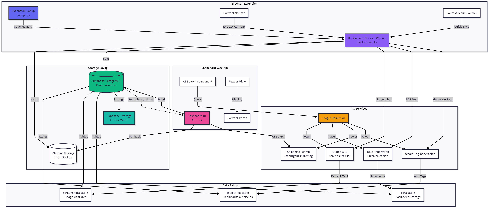
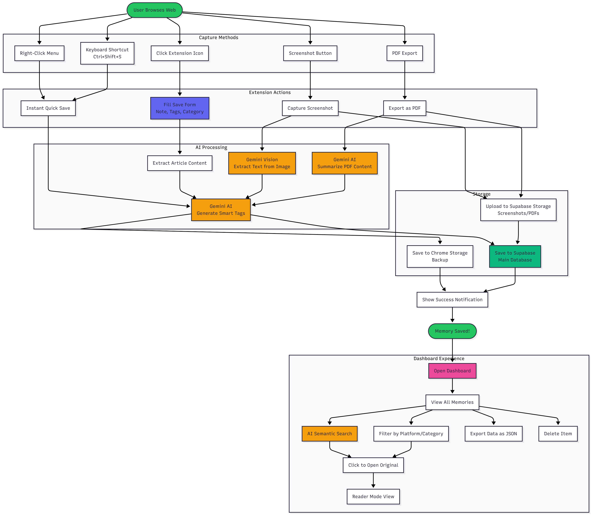

# 🧠 Second Memory

> **Your Personal Second Brain** - A powerful, AI-enhanced knowledge management system that helps you capture, organize, and retrieve information from the web effortlessly.

Second Memory is a comprehensive Chrome extension and web dashboard that transforms how you save and discover information. Whether it's articles, screenshots, or PDF documents, Second Memory uses advanced AI (Google Gemini) to help you find exactly what you're looking for with semantic search that understands context, not just keywords.

---
### Apps architecture diagram
## Application Architecture



## User Flow



## 📋 Table of Contents

- [Features](#-features)
- [What Makes It Special](#-what-makes-it-special)
- [Installation & Setup](#-installation--setup)
- [Usage Guide](#-usage-guide)
- [Project Structure](#-project-structure)
- [Technology Stack](#-technology-stack)
- [Configuration](#-configuration)
- [Development](#-development)
- [Database Schema](#-database-schema)
- [AI Features Explained](#-ai-features-explained)
- [Troubleshooting](#-troubleshooting)
- [Future Roadmap](#-future-roadmap)
- [Contributing](#-contributing)
- [License](#-license)

---

## ✨ Features

### 🚀 **Multi-Format Capture**

#### 📚 **Bookmarks & Articles**
- **One-click save** from any webpage
- **Auto-detection** of page title, URL, and platform
- **Reader Mode** - Extract and save complete article text for offline reading
- **Full-text search** - Search through entire article content, not just titles
- **Smart categorization** - Auto-suggest categories based on platform
- **Personal notes** - Add context about why you're saving this
- **Tag system** - Organize with comma-separated tags
- **Platform badges** - Visual indicators for YouTube, GitHub, Medium, etc.

#### 📸 **Screenshots**
- **Visible tab capture** - Screenshot any webpage instantly
- **AI text extraction** - Automatically extract all visible text using Gemini Vision
- **Searchable screenshots** - Find screenshots by the text they contain
- **Preview before save** - Review screenshot before confirming
- **Auto-upload to cloud** - Stored in Supabase Storage for access anywhere

#### 📕 **PDF Documents**
- **PDF export** - Save PDF pages directly from browser
- **AI summarization** - Generate intelligent summaries using Gemini
- **Full-text extraction** - Extract and index complete PDF content
- **Metadata tracking** - Page count, file size, and more
- **Cloud storage** - Access your PDFs from anywhere

### 🔍 **AI-Powered Semantic Search**

- **Gemini AI integration** - Understands context and meaning, not just keywords
- **Semantic matching** - Find related content even without exact keyword matches
- **Multi-content search** - Search across bookmarks, screenshots, and PDFs simultaneously
- **Real-time results** - Instant search results as you type
- **Search indicators** - Visual feedback when AI is processing your query
- **Filtered search** - Combine AI search with category and platform filters

### 🎨 **Beautiful, Modern Interface**

- **Responsive design** - Works perfectly on desktop, tablet, and mobile
- **Multiple view modes** - Choose from Masonry, Grid, or List layouts
- **Smooth animations** - Polished transitions and hover effects
- **Dark gradients** - Beautiful purple-blue gradient theme
- **Platform emojis** - Visual recognition with emoji badges
- **Keyboard shortcuts** - Fast navigation with `/` for search focus
- **Empty states** - Helpful guidance when starting fresh

### 📊 **Smart Organization**

- **Category filtering** - Filter by custom categories (Article, Video, Tutorial, etc.)
- **Platform filtering** - Filter by source platform (YouTube, GitHub, Twitter, etc.)
- **Tag-based organization** - Create custom tags for flexible categorization
- **Section tabs** - Separate views for All, Bookmarks, Screenshots, and PDFs
- **Count badges** - See item counts for each category and platform
- **Timeline view** - Chronologically organized by creation date

### ☁️ **Cloud Sync & Storage**

- **Supabase backend** - Reliable PostgreSQL database and file storage
- **Real-time sync** - Changes appear instantly across all devices
- **Cloud storage** - Screenshots and PDFs stored in Supabase Storage
- **Offline support** - Fallback to local storage when needed
- **Data export** - Export all your memories as JSON backup
- **Privacy-first** - Your data, your control

### 🔒 **Privacy & Security**

- **Your data, your choice** - Full control over your information
- **Local-first approach** - Data stored locally with cloud backup
- **No tracking** - No analytics, no third-party tracking
- **Secure storage** - Supabase provides enterprise-grade security
- **Export anytime** - Take your data with you whenever you want

---

## 🌟 What Makes It Special

### 🤖 **Advanced AI Integration**

Unlike traditional bookmark managers that rely on keyword matching, Second Memory uses **Google Gemini AI** to understand the meaning and context of your content. This means:

- **Find by concept** - Search for "machine learning tutorials" and find related content even if those exact words aren't in the title
- **Understand context** - The AI understands relationships between concepts
- **Extract insights** - Automatically extract text from images and summarize PDFs
- **Smart recommendations** - (Coming soon) Get suggestions based on your saved content

### 🔄 **Real-Time Synchronization**

All your captures sync instantly across devices using Supabase's real-time capabilities. Save on your desktop, view on your phone - it just works.

### 📖 **Reader Mode**

Never lose access to content again. Reader Mode extracts the complete article text and stores it locally, so you can read important articles even if the original website goes down.

### 🎯 **Unified Search Experience**

Search across all your content types (bookmarks, screenshots, PDFs) with a single query. The AI understands what you're looking for and finds it across all formats.

---

## 🛠️ Installation & Setup

### Prerequisites

Before you begin, ensure you have the following installed:

- **Node.js** 18+ ([Download](https://nodejs.org/))
- **npm** (comes with Node.js)
- **Google Chrome** browser (for the extension)
- **Supabase account** (free tier works fine) - [Sign up](https://supabase.com)

### Step 1: Clone the Repository

```bash
git clone <repository-url>
cd Appointy
```

### Step 2: Set Up Supabase

1. **Create a Supabase project** at [supabase.com](https://supabase.com)
2. **Get your credentials**:
   - Go to Project Settings → API
   - Copy your `Project URL` (Supabase URL)
   - Copy your `anon/public` key (Supabase Anon Key)
3. **Run the database setup**:
   - Go to SQL Editor in your Supabase dashboard
   - Copy and paste the contents of `supabase-setup.sql`
   - Execute the SQL script to create tables and storage buckets

### Step 3: Configure Environment Variables

Create environment variable files for both the extension and dashboard:

**For Dashboard** (`dashboard/.env`):
```env
VITE_SUPABASE_URL=your_supabase_project_url
VITE_SUPABASE_ANON_KEY=your_supabase_anon_key
VITE_CLAUDE_API_KEY=your_gemini_api_key  # Optional, for AI features
```

**For Extension** (`extension/.env`):
```env
VITE_SUPABASE_URL=your_supabase_project_url
VITE_SUPABASE_ANON_KEY=your_supabase_anon_key
VITE_CLAUDE_API_KEY=your_gemini_api_key  # Optional, for AI features
```

> **Note**: Get your Gemini API key from [Google AI Studio](https://makersuite.google.com/app/apikey)

### Step 4: Install Dependencies

Install dependencies for both the extension and dashboard:

```bash
# Install root dependencies (if any)
npm install

# Install extension dependencies
cd extension
npm install

# Install dashboard dependencies
cd ../dashboard
npm install
```

### Step 5: Build the Projects

Build both the extension and dashboard:

```bash
# From the root directory
npm run build

# Or build individually:
# Build extension
cd extension
npm run build

# Build dashboard
cd ../dashboard
npm run build
```

### Step 6: Load the Extension in Chrome

1. Open Google Chrome
2. Navigate to `chrome://extensions/`
3. Enable **Developer mode** (toggle in top-right corner)
4. Click **Load unpacked**
5. Select the `extension` folder (not the `extension/dist` folder)
6. The extension should now appear in your extensions list
7. **Pin the extension** to your toolbar for easy access

### Step 7: Run the Dashboard (Development)

For development, you can run the dashboard with hot-reload:

```bash
cd dashboard
npm run dev
```

The dashboard will be available at `http://localhost:5173`

> **Note**: In production, you can deploy the dashboard to any static hosting service (Vercel, Netlify, etc.) or serve it from the `dashboard/dist` folder.

---

## 🎯 Usage Guide

### Capturing Content

#### Saving a Bookmark/Article

1. **Navigate** to any webpage you want to save
2. **Click the extension icon** (🧠) in your Chrome toolbar, or press `Alt+Shift+M`
3. **Review auto-detected information** - Title, URL, and platform are automatically filled
4. **Add a personal note** - Explain why you're saving this (e.g., "Great explanation of React hooks")
5. **Add tags** - Separate multiple tags with commas (e.g., `react, hooks, tutorial`)
6. **Select a category** - Choose from predefined categories or use "Uncategorized"
7. **Enable Reader Mode** (optional) - Toggle to extract and save the full article text
8. **Click "Save to Memory"** - Your bookmark is now saved!

#### Capturing a Screenshot

1. **Navigate** to the webpage you want to screenshot
2. **Click the extension icon**
3. **Click the "Screenshot" button** in the quick actions section
4. **Review the preview** - A modal will show your screenshot
5. **Confirm or cancel** - Click "Save & Extract Text" to save, or "Cancel" to discard
6. **AI processing** - The extension will automatically extract text from the screenshot using Gemini Vision
7. **Done!** - Your screenshot is now searchable by the extracted text

#### Exporting a PDF

1. **Navigate** to a PDF page** (URL ends with `.pdf`)
2. **Click the extension icon**
3. **Click the "Export PDF" button** (only visible on PDF pages)
4. **Wait for processing** - The PDF is downloaded and uploaded to Supabase
5. **AI summarization** - Gemini will generate a summary of the PDF content
6. **Done!** - Your PDF is now saved with full-text search capability

### Viewing & Searching Your Memories

#### Opening the Dashboard

**Option 1: From Extension**
- Click the extension icon
- Click **"📊 View All Memories"** at the bottom of the popup

**Option 2: Direct URL**
- Navigate to `http://localhost:5173` (in development)
- Or your deployed dashboard URL (in production)

#### Using Search

1. **Click the search bar** or press `/` to focus it
2. **Type your query** - Use natural language (e.g., "React hooks tutorial")
3. **Watch results update** - Results filter in real-time as you type
4. **AI processing** - When you see the "🤖 AI Semantic" indicator, Gemini is analyzing your query
5. **Review results** - Results are ranked by relevance, not just keyword matches

#### Filtering Content

1. **Use category filter** - Click a category in the sidebar to filter by type
2. **Use platform filter** - Click a platform to see only content from that source
3. **Combine filters** - Use both category and platform filters together
4. **Clear filters** - Click "Clear Filters" to reset

#### View Modes

- **Masonry** (🧱) - Pinterest-style layout, great for visual browsing
- **Grid** (⊞) - Uniform grid layout, organized and clean
- **List** (☰) - Compact list view, shows more items at once

#### Section Tabs

- **All** - View all content types together
- **Bookmarks** - View only bookmarks and articles
- **Screenshots** - View only screenshots
- **PDFs** - View only PDF documents

### Keyboard Shortcuts

- `/` - Focus search bar
- `Alt+Shift+M` - Open extension popup
- `Ctrl+Shift+S` - Quick save current page (if configured)
- `Esc` - Clear search (when search is focused)

### Exporting Your Data

1. **Open the dashboard**
2. **Click "📥 Export"** in the top-right corner
3. **Download** - A JSON file will be downloaded with all your memories
4. **Backup** - Keep this file as a backup or import it elsewhere

### Using Reader Mode

1. **Open a saved bookmark** in the dashboard
2. **Look for the "📖 Read" button** (only available if Reader Mode was enabled)
3. **Click to open** - A beautiful reader view opens with the full article text
4. **Read offline** - The article text is stored locally, so you can read it even if the original site is down

---

## 📁 Project Structure

```
Appointy/
├── extension/                 # Chrome Extension
│   ├── src/
│   │   ├── popup.tsx         # Main popup UI component
│   │   ├── background.ts     # Background service worker
│   │   ├── main.tsx          # Popup entry point
│   │   ├── lib/
│   │   │   ├── supabase.ts   # Supabase client configuration
│   │   │   ├── gemini.ts     # Gemini AI integration
│   │   │   ├── contentExtractor.ts  # Content extraction utilities
│   │   │   └── pdfUtils.ts   # PDF handling utilities
│   │   └── styles.css        # Tailwind CSS styles
│   ├── dist/                 # Built extension files
│   ├── manifest.json         # Chrome extension manifest
│   ├── icon.png              # Extension icon
│   ├── vite.config.ts        # Vite configuration
│   └── package.json          # Extension dependencies
│
├── dashboard/                # Web Dashboard
│   ├── src/
│   │   ├── App.tsx           # Main dashboard component
│   │   ├── main.tsx          # Dashboard entry point
│   │   ├── components/
│   │   │   ├── ContentCard.tsx      # Bookmark/article card
│   │   │   ├── ScreenshotCard.tsx   # Screenshot card
│   │   │   ├── PDFCard.tsx          # PDF card
│   │   │   ├── SearchBar.tsx        # Search bar component
│   │   │   └── ReaderView.tsx       # Reader mode component
│   │   ├── lib/
│   │   │   ├── supabase.ts   # Supabase client
│   │   │   └── gemini.ts     # Gemini AI integration
│   │   ├── utils/
│   │   │   ├── search.ts     # Basic search utilities
│   │   │   └── semanticSearch.ts    # AI semantic search
│   │   ├── types.ts          # TypeScript type definitions
│   │   └── styles.css        # Tailwind CSS styles
│   ├── dist/                 # Built dashboard files
│   ├── vite.config.ts        # Vite configuration
│   └── package.json          # Dashboard dependencies
│
├── supabase-setup.sql        # Database schema and setup
├── supabase-update-reader-mode.sql  # Reader mode updates
├── build-all.ps1             # Build script for Windows
├── package.json              # Root package.json with workspace scripts
└── README.md                 # This file
```

---

## 💻 Technology Stack

### Frontend

- **React 18** - Modern UI library with hooks
- **TypeScript** - Type-safe JavaScript
- **Vite** - Fast build tool and dev server
- **Tailwind CSS** - Utility-first CSS framework
- **Chrome Extension API** - Browser extension capabilities

### Backend & Storage

- **Supabase** - Backend-as-a-Service
  - **PostgreSQL** - Reliable relational database
  - **Storage** - File storage for screenshots and PDFs
  - **Real-time** - WebSocket-based real-time updates
  - **Row Level Security** - Database security policies

### AI & Search

- **Google Gemini AI** - Advanced AI for semantic search and content analysis
- **Gemini Vision** - Image text extraction from screenshots
- **Full-text search** - PostgreSQL full-text search indexes
- **Semantic search** - AI-powered context-aware search

### Development Tools

- **npm** - Package manager
- **Vite** - Build tool and dev server
- **TypeScript** - Type checking
- **ESLint** - Code linting (if configured)
- **PostCSS** - CSS processing
- **Autoprefixer** - CSS vendor prefixing

---

## ⚙️ Configuration

### Environment Variables

Both the extension and dashboard require environment variables. Create `.env` files in each directory:

**`extension/.env`** and **`dashboard/.env`**:
```env
# Required: Supabase Configuration
VITE_SUPABASE_URL=https://your-project.supabase.co
VITE_SUPABASE_ANON_KEY=your-anon-key

# Optional: Gemini AI (for AI features)
VITE_CLAUDE_API_KEY=your-gemini-api-key
```

### Supabase Configuration

1. **Create a Supabase project** at [supabase.com](https://supabase.com)
2. **Run the setup SQL** - Execute `supabase-setup.sql` in the SQL Editor
3. **Configure storage buckets** - The SQL script creates three buckets:
   - `memory-images` - For thumbnails
   - `screenshots` - For screenshot images
   - `pdfs` - For PDF documents
4. **Set up Row Level Security** - The SQL script includes RLS policies

### Gemini API Key

1. **Get API key** from [Google AI Studio](https://makersuite.google.com/app/apikey)
2. **Add to `.env`** files as `VITE_CLAUDE_API_KEY`
3. **Rebuild** the extension and dashboard after adding the key

> **Note**: AI features will work without the API key, but with reduced functionality. Semantic search and content extraction require the API key.

---

## 🚀 Development

### Running in Development Mode

#### Dashboard Development

```bash
cd dashboard
npm run dev
```

The dashboard will start at `http://localhost:5173` with hot-reload enabled.

#### Extension Development

```bash
cd extension
npm run dev
```

This runs Vite in watch mode. After making changes:
1. Wait for Vite to rebuild
2. Go to `chrome://extensions/`
3. Click the reload button on the Second Memory extension
4. Test your changes

### Building for Production

#### Build Both Projects

```bash
# From root directory
npm run build
```

#### Build Individually

```bash
# Build extension
cd extension
npm run build

# Build dashboard
cd ../dashboard
npm run build
```

### Development Workflow

1. **Make changes** to source files in `src/`
2. **Vite rebuilds** automatically (in dev mode)
3. **Reload extension** in Chrome (`chrome://extensions/`)
4. **Test changes** in the extension popup or dashboard
5. **Check console** for errors (F12 in Chrome)

### Debugging

#### Extension Debugging

1. **Open extension popup** - Right-click extension icon → "Inspect popup"
2. **Background script** - Go to `chrome://extensions/` → Click "service worker" link
3. **Console logs** - Check browser console for errors

#### Dashboard Debugging

1. **Open DevTools** - Press F12 in the dashboard
2. **Check Console** - Look for errors or warnings
3. **Network tab** - Verify Supabase API calls
4. **Application tab** - Check local storage and Supabase data

---

## 🗄️ Database Schema

### Tables

#### `memories` Table
Stores bookmarks and articles with full-text content.

```sql
- id (TEXT, PRIMARY KEY)
- url (TEXT, NOT NULL)
- title (TEXT, NOT NULL)
- note (TEXT)
- tags (TEXT[])
- category (TEXT, NOT NULL)
- platform (TEXT, NOT NULL)
- timestamp (BIGINT, NOT NULL)
- created_at (TIMESTAMP)
- favicon (TEXT)
- thumbnail (TEXT)
- selected_text (TEXT)
- full_text (TEXT)          -- Reader Mode content
- excerpt (TEXT)            -- First 500 characters
- word_count (INTEGER)      -- Number of words
- metadata (JSONB)          -- Additional data
- user_id (TEXT)            -- For future multi-user support
```

#### `screenshots` Table
Stores screenshot captures with extracted text.

```sql
- id (TEXT, PRIMARY KEY)
- url (TEXT, NOT NULL)
- title (TEXT, NOT NULL)
- image_url (TEXT, NOT NULL)      -- Supabase Storage URL
- extracted_text (TEXT)           -- AI-extracted text
- tags (TEXT[])
- timestamp (BIGINT, NOT NULL)
- created_at (TIMESTAMP)
- metadata (JSONB)
- user_id (TEXT)
```

#### `pdfs` Table
Stores PDF documents with summaries and full text.

```sql
- id (TEXT, PRIMARY KEY)
- url (TEXT, NOT NULL)
- title (TEXT, NOT NULL)
- pdf_url (TEXT, NOT NULL)        -- Supabase Storage URL
- summary (TEXT)                  -- AI-generated summary
- full_text (TEXT)                -- Extracted PDF text
- tags (TEXT[])
- page_count (INTEGER)
- file_size (BIGINT)
- timestamp (BIGINT, NOT NULL)
- created_at (TIMESTAMP)
- metadata (JSONB)
- user_id (TEXT)
```

### Indexes

The database includes optimized indexes for fast searches:

- **Timestamp indexes** - For chronological sorting
- **Platform indexes** - For platform filtering
- **Category indexes** - For category filtering
- **Tag indexes** - GIN indexes for array searches
- **Full-text search indexes** - For content search
- **Created_at indexes** - For date-based queries

### Storage Buckets

- **`memory-images`** - Thumbnails and images
- **`screenshots`** - Screenshot files
- **`pdfs`** - PDF documents

All buckets are configured with public read access and authenticated upload/delete permissions.

---

## 🤖 AI Features Explained

### Semantic Search

**What it does**: Understands the meaning and context of your search query, not just keywords.

**How it works**:
1. You type a search query (e.g., "machine learning basics")
2. Gemini AI analyzes your query and all saved content
3. Returns results based on semantic similarity, not just keyword matches
4. Finds related content even if it doesn't contain your exact search terms

**Example**: Searching for "React hooks" will find content about "useState", "useEffect", and "custom hooks" even if those exact words aren't in the title.

### Screenshot Text Extraction

**What it does**: Automatically extracts all visible text from screenshots using Gemini Vision.

**How it works**:
1. You capture a screenshot of a webpage
2. The screenshot is sent to Gemini Vision API
3. Gemini analyzes the image and extracts all visible text
4. The extracted text is stored and made searchable
5. You can now find screenshots by searching for text they contain

**Use cases**:
- Screenshot documentation or tutorials
- Capture error messages or code snippets
- Save important information from images
- Create searchable image library

### PDF Summarization

**What it does**: Generates intelligent summaries of PDF documents using Gemini AI.

**How it works**:
1. You export a PDF from a webpage
2. The PDF is uploaded to Supabase Storage
3. The full text is extracted from the PDF
4. Gemini analyzes the content and generates a summary
5. Both the summary and full text are stored for search

**Benefits**:
- Quickly understand PDF content without reading the entire document
- Search PDFs by their content, not just titles
- Get key insights from long documents

### Reader Mode

**What it does**: Extracts and saves the complete article text for offline reading.

**How it works**:
1. When saving a bookmark, enable "Reader Mode"
2. The extension extracts the main content from the webpage
3. Removes ads, navigation, and other clutter
4. Saves the clean article text to the database
5. You can read the article later even if the original site is down

**Benefits**:
- Never lose access to important articles
- Read without distractions
- Offline access to content
- Full-text search through article content

---

## 🐛 Troubleshooting

### Extension Issues

#### Extension Not Loading

**Problem**: Extension doesn't appear in Chrome or shows errors.

**Solutions**:
1. Check that you've built the extension (`npm run build` in `extension/` folder)
2. Verify `dist/` folder exists with built files
3. Reload the extension in `chrome://extensions/`
4. Check the browser console for errors (F12)
5. Verify `manifest.json` is valid JSON

#### Popup Not Showing

**Problem**: Clicking extension icon doesn't open popup.

**Solutions**:
1. Reload the extension in `chrome://extensions/`
2. Check that `dist/popup.html` exists
3. Verify `manifest.json` points to correct popup path
4. Check browser console for errors
5. Try disabling and re-enabling the extension

#### Data Not Saving

**Problem**: Memories aren't being saved to Supabase.

**Solutions**:
1. Verify Supabase credentials in `.env` file
2. Check that Supabase project is active
3. Verify database tables exist (run `supabase-setup.sql`)
4. Check browser console for API errors
5. Verify Row Level Security policies allow inserts

### Dashboard Issues

#### Dashboard Not Loading

**Problem**: Dashboard shows blank page or errors.

**Solutions**:
1. Check that dependencies are installed (`npm install` in `dashboard/`)
2. Verify environment variables are set in `.env`
3. Check browser console for errors (F12)
4. Verify Supabase credentials are correct
5. Check network tab for failed API requests

#### No Memories Showing

**Problem**: Dashboard is empty even after saving memories.

**Solutions**:
1. Verify memories were saved successfully (check extension popup)
2. Check Supabase dashboard to see if data exists
3. Verify Supabase credentials in dashboard `.env`
4. Check browser console for API errors
5. Try refreshing the page
6. Check that RLS policies allow SELECT operations

#### Search Not Working

**Problem**: Search doesn't return results or shows errors.

**Solutions**:
1. Verify Gemini API key is set (if using AI search)
2. Check browser console for API errors
3. Verify you have saved memories to search
4. Try a simpler search query
5. Check network tab for failed API requests

### Supabase Issues

#### Database Connection Failed

**Problem**: Can't connect to Supabase database.

**Solutions**:
1. Verify Supabase URL and key in `.env` files
2. Check that Supabase project is active (not paused)
3. Verify internet connection
4. Check Supabase status page for outages
5. Verify API keys haven't expired

#### Storage Upload Failed

**Problem**: Screenshots or PDFs aren't uploading.

**Solutions**:
1. Verify storage buckets exist in Supabase
2. Check storage bucket policies allow uploads
3. Verify file size limits (Supabase has limits)
4. Check browser console for upload errors
5. Verify storage bucket names match in code

### AI Features Issues

#### Semantic Search Not Working

**Problem**: AI search doesn't work or returns errors.

**Solutions**:
1. Verify Gemini API key is set in `.env`
2. Check API key is valid and has credits
3. Check browser console for API errors
4. Verify API quotas haven't been exceeded
5. Try a simpler search query

#### Screenshot Text Extraction Failed

**Problem**: Text isn't extracted from screenshots.

**Solutions**:
1. Verify Gemini API key is set
2. Check that screenshot was captured successfully
3. Verify image is clear and contains text
4. Check browser console for API errors
5. Try capturing a different screenshot

---

## 🗺️ Future Roadmap

### Phase 2: Enhanced Features

- [ ] **Keyboard shortcuts** - Customizable keyboard shortcuts
- [ ] **Context menu** - Right-click to save selected text
- [ ] **Badge counter** - Show number of saves today
- [ ] **Tag autocomplete** - Suggest tags as you type
- [ ] **Advanced filters** - Date range, file size, and more
- [ ] **Bulk operations** - Delete, tag, or categorize multiple items
- [ ] **Import/Export** - Import from Pocket, Raindrop, etc.

### Phase 3: Advanced AI Features

- [ ] **Auto-tagging** - AI suggests tags based on content
- [ ] **Smart categories** - Auto-categorize based on content
- [ ] **Knowledge graph** - Visualize relationships between memories
- [ ] **Related content** - Find similar or related memories
- [ ] **Content recommendations** - Get suggestions based on your interests
- [ ] **Flashcard generation** - Create flashcards from highlights

### Phase 4: Collaboration & Sync

- [ ] **Multi-user support** - Share memories with team
- [ ] **Collaborative collections** - Work together on research
- [ ] **Comments & annotations** - Add notes to shared content
- [ ] **Offline mode** - Full offline functionality with sync
- [ ] **Mobile app** - iOS and Android apps
- [ ] **Browser import** - Import from Chrome bookmarks, Firefox, etc.

### Phase 5: Advanced Features

- [ ] **Webhooks** - Integrate with other services
- [ ] **API access** - Programmatic access to your memories
- [ ] **Plugins** - Extend functionality with plugins
- [ ] **Themes** - Customizable themes and colors
- [ ] **Analytics** - Insights into your saving habits
- [ ] **Backup & restore** - Automated backups

---

## 🤝 Contributing

We welcome contributions! Here's how you can help:

### Getting Started

1. **Fork the repository**
2. **Clone your fork** - `git clone <your-fork-url>`
3. **Create a branch** - `git checkout -b feature/your-feature`
4. **Make changes** - Implement your feature or fix
5. **Test thoroughly** - Ensure everything works
6. **Commit changes** - `git commit -m "Add your feature"`
7. **Push to fork** - `git push origin feature/your-feature`
8. **Open a Pull Request** - Describe your changes

### Code Style

- Follow TypeScript best practices
- Use meaningful variable and function names
- Add comments for complex logic
- Keep components small and focused
- Write descriptive commit messages

### Reporting Issues

If you find a bug or have a feature request:

1. **Check existing issues** - See if it's already reported
2. **Create a new issue** - Provide detailed information
3. **Include steps to reproduce** - Help us understand the problem
4. **Add screenshots** - Visual context helps
5. **Be patient** - We'll get to it as soon as we can

---

## 📝 License

MIT License - Feel free to use, modify, and distribute!

See the [LICENSE](LICENSE) file for details.

---

## 🙏 Acknowledgments

- **Supabase** - For the amazing backend platform
- **Google Gemini** - For powerful AI capabilities
- **React Team** - For the incredible React framework
- **Vite Team** - For the fast build tool
- **Tailwind CSS** - For the beautiful utility-first CSS

---

## 💬 Support

Need help? Here are some resources:

- **Documentation** - This README file
- **Issues** - GitHub Issues for bugs and features
- **Discussions** - GitHub Discussions for questions
- **Email** - Contact the maintainers

---

**Made with ❤️ by Gourab for peace of mind**

*Your data stays local and private. Your memories, your control.*

---

## 🎯 Quick Start Checklist

- [ ] Install Node.js 18+
- [ ] Clone the repository
- [ ] Set up Supabase project
- [ ] Run `supabase-setup.sql`
- [ ] Configure `.env` files
- [ ] Install dependencies (`npm install`)
- [ ] Build extension and dashboard (`npm run build`)
- [ ] Load extension in Chrome
- [ ] Run dashboard (`npm run dev`)
- [ ] Save your first memory!
- [ ] Start organizing your digital life! 🚀

---

*Last updated: 2024*
